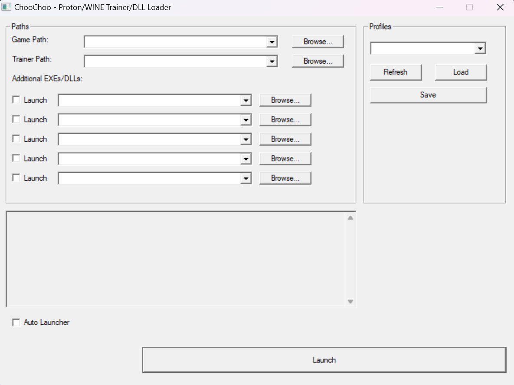

# ChooChoo

**ChooChoo** is a Proton/WINE gaming-focused trainer and DLL loader featuring a dynamic UI and extensive functionality. It operates seamlessly under both Windows and Proton/WINE environments, providing users with an intuitive way to manage and launch games, trainers, patchers, or additional DLLs.

<p align="center">
    
</p>

---

## Download ChooChoo

Get the latest version of **ChooChoo** from the official releases page on GitHub. Click the button below to download:

[](https://github.com/wowitsjack/choochoo-loader/releases)

---

## HOW-TO (Steam Deck)

### Adding ChooChoo to Steam

1. Switch your **Steam Deck** to **Desktop Mode**.
2. Open **Steam** in Desktop Mode.
3. Navigate to **Games** and select **Add a Non-Steam Game to My Library**.
4. Browse to locate `choochoo.exe` and add it to your library.

### Launching ChooChoo

1. Open **Properties** for **ChooChoo** in your Steam Library.
2. Enable **Force the use of a specific Steam Play compatibility tool** (Compatibility Mode).
3. Select a Proton version (Proton 9+ recommended).
4. Launch **ChooChoo** from your Steam Library.

---

## HOW-TO (macOS with Whisky)

### Adding ChooChoo to Whisky

1. Install **Whisky** on macOS if you have not already.
2. Open **Whisky** and create a new **bottle**.
3. Inside the bottle, use **"Run Executable"** to browse for `choochoo.exe` and add it.

### Launching ChooChoo

1. Open **Whisky** and select the bottle where **ChooChoo** is installed.
2. Enable **DXVK** and any other necessary compatibility settings.
3. Click **Run** to launch **ChooChoo** inside Whisky.

---

## Automate Game & Trainer Launching

ChooChoo can automate launching both a **game** and **trainer**, eliminating the need for manual setup each time. After configuring, simply launch ChooChoo from Steam, and it will automatically start all processes.

### Setting Up ChooChoo in Steam

1. **Add ChooChoo as a Non-Steam Game**  
   - Open **Steam** (on your Steam Deck or desktop).
   - Go to **Games** > **Add a Non-Steam Game to My Library**.
   - Browse for `choochoo.exe` and add it.

2. **Create a Profile for Your Game & Trainer**  
   - Launch **ChooChoo** from your Steam Library.
   - In the main UI, set the **Game Path** to your game’s executable.
   - Set the **Trainer Path** to your trainer’s executable.
   - (Optional) Add any additional EXEs or DLLs for patching or injection.
   - Save the configuration as a **profile** for quick reloading.

3. **Enable Auto-Launch**  
   - Check the **Auto Launcher** box to automatically run the last-used configuration at startup.
   - Close or exit ChooChoo to save your settings.

### Automatic Launching

- Whenever you start **ChooChoo** from Steam, it will automatically launch your **game, trainer, and additional executables**.
- A countdown will appear, allowing you to cancel or modify settings before launching.
- If needed, cancel the countdown to make changes or switch profiles.

Once set up, simply opening **ChooChoo** from Steam will instantly load your game, trainer, and any extra processes—providing a smooth, efficient workflow.

---

## Bonus: Customize the ChooChoo Launcher with SteamGridDB Plugin

Take your customization further on the Steam Deck by using the **SteamGridDB** Plugin. This plugin lets you add custom artwork to your **ChooChoo** launcher for a more polished look.

## Renaming the Launcher in Steam

To ensure a consistent look:

1. Open your **Steam Library**.
2. Locate **ChooChoo** (the non-Steam game entry you added).
3. Right-click (or press the options button) and select **Properties**.
4. Under the **Shortcut** tab, rename it (e.g., **ChooChoo Trainer** or any preferred title).

Your Steam Library will now display this launcher with a name and artwork that match your style.

### 1. Install Decky Loader

- Follow the instructions on the Decky Loader GitHub page to install it onto your Steam Deck.

### 2. Install the SteamGridDB Plugin

1. On your Steam Deck, open the **Quick Access Menu**.
2. Navigate to the **Plugins** section and browse the Plugin Store.
3. Search for **SteamGridDB** and install it.

### 3. Customize ChooChoo Artwork

1. After installing the plugin, open it from the **Quick Access Menu**.
2. Select the **ChooChoo** entry (the one you added as a non-Steam game).
3. Browse and download high-quality custom artwork, including:
   - **Grid** images
   - **Hero** images
   - **Icons**
4. Apply the artwork to make your ChooChoo launcher visually match your desired theme.

---

## Features

- **Game & Trainer Launching**  
  Configure and launch both a game executable and a trainer simultaneously.
- **Multiple Additional Executables/DLLs**  
  Launch or inject up to **5 additional EXEs/DLLs** into the current process.
- **Profile System**  
  - Save multiple **profiles** with different setups.
  - Easily switch profiles using an **editable combo box**.
  - Profiles are stored in the `profiles` folder for organization.
- **Auto Launcher**  
  - Automatically loads and runs the last-used configuration on startup.
  - Displays a **countdown modal** that can be canceled if you need to intervene.
  - Saves current settings to `profiles/last.ini`.
- **Recent Files (MRU) Support**  
  - Keeps a record of recently used paths (`recent.ini`) for quicker reconfiguration.
- **Command Line Handling**  
  - Parses command-line input, dynamically setting the working directory.
  - Supports running batch/scripts (`.bat`, `.cmd`, `.com`) via `cmd.exe /C`.
  - Loads `.dll` files using `LoadLibraryW`.
- **UI Compatibility for Wine/Proton**  
  - Custom GroupBox fixes for improved rendering under Wine/Proton.
  - Uses `CreateJobObjectW` to ensure all launched processes are terminated when ChooChoo exits.

---

## Compilation

ChooChoo is intended to be compiled with **MinGW GCC** and Windows API libraries.

### Build Instructions (MinGW GCC)
```sh
gcc choochoo.c -mwindows -o choochoo.exe -lcomctl32 -lshlwapi
```
